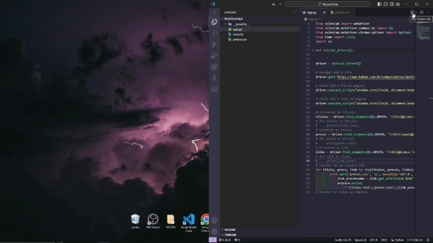

# Coletor Preços

## Sobre o projeto

Coletor Preços é uma aplicação back-and Python, construída para estudo e portifólio, baseado em cursos que venho fazendo.

A aplicação consiste em uma Automação para varredura de dados. Que  consiste em pegar titulos, preços e links, de um determinado site.

Essa automação consiste em uma varredura de alguns itens a venda no site da Kabum. Onde se pesquisa o produto, e armazenamos os dados
como TITULO/PREÇO/LINK, do produto em um arquivo CSV.

    

# Tecnologias utilizadas
## Back end
- Python
- BIBLIOTECA PYTHON :
- from selenium import webdriver
- from selenium.webdriver.common.by import By
- from selenium.webdriver.chrome.options import Options
- from time import sleep
- import os

# Como executar o projeto

## Back end
Pré-requisitos: possuir Python instalado em sua maquina, e suas devidas blibiotecas: 
- from selenium import webdriver
- from selenium.webdriver.common.by import By
- from selenium.webdriver.chrome.options import Options
- from time import sleep
- import os

## Execução
Consiste somente em ter todas as bibliotecas instaladas e caso nencessario corrigir a resolução de iniciação do Selenium.

# Autor

Igor Parro Arcas 

Linkedin: https://www.linkedin.com/in/igor-parro-arcas/
 
portifólio: https://igorparrodev.wixsite.com/my-site-1
